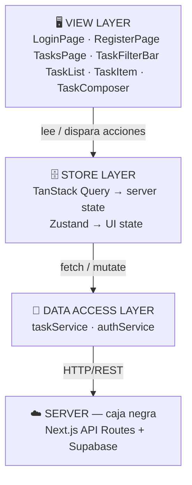
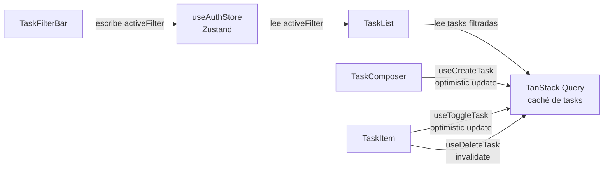

# Architecture — Task App

> Aplicación de gestión de tareas personales con autenticación.
> Cada usuario ve y gestiona únicamente sus propias tareas.

---

## R — Requirements

### ¿Qué estamos construyendo?

Una app web donde usuarios registrados pueden crear, completar
y eliminar tareas personales organizadas por estado.

### Functional Requirements (scope de esta versión)

- [ ] Registro con email y contraseña
- [ ] Login / logout
- [ ] Crear tarea (título obligatorio, descripción opcional)
- [ ] Marcar tarea como completada / pendiente
- [ ] Eliminar tarea
- [ ] Ver lista de tareas filtrada por estado (todas / pendientes / completadas)

### Out of scope

- Fechas límite y recordatorios → fase 2
- Colaboración entre usuarios → no aplica para este producto
- Subtareas → fase 2
- Notificaciones push → no aplica

### Non-functional Requirements

- **Plataformas:** Desktop + Mobile (responsive)
- **Usuarios estimados:** pequeño (< 1000 usuarios)
- **Latencia aceptable:** < 300ms para operaciones CRUD
- **Offline support:** no
- **Autenticación:** requerida para todo excepto login y register
- **Accesibilidad:** WCAG 2.1 AA básica
- **i18n:** solo español
- **SEO:** no aplica — app privada detrás de auth

---

## A — Architecture

### Diagrama de componentes cliente

### Componentes clave y sus responsabilidades

**TasksPage** (View) — orquesta el layout completo de la pantalla principal.

**TaskFilterBar** (View) — botones Todas / Pendientes / Completadas. Escribe `activeFilter` en Zustand.

**TaskList** (View) — lee las tareas filtradas y renderiza la lista.

**TaskItem** (View) — una tarea individual: checkbox, título y botón eliminar.

**TaskComposer** (View) — input para crear una tarea nueva.

**LoginPage / RegisterPage** (View) — formularios de autenticación.

**useTasksQuery** (Store) — fetch y caché de la lista de tareas del usuario via TanStack Query.

**useCreateTask / useToggleTask / useDeleteTask** (Store) — mutaciones con sus estrategias de optimistic update. Ver ADR-002.

**useAuthStore** (Store) — estado del usuario autenticado y filtro activo. Vive en Zustand porque es UI state puro, no server state.

**taskService** (Data access) — abstrae todas las llamadas HTTP a `/api/tasks`.

**authService** (Data access) — abstrae las llamadas HTTP a `/api/auth/*`.

### Decisión de rendering strategy

Toda la app usa **CSR (Client Side Rendering)**.

No hay contenido público que se beneficie de SSR o SSG. Es un dashboard privado detrás de autenticación donde el SEO no aplica. Next.js se usa por su routing, API routes y facilidad de deployment — no por sus capacidades de server rendering.

---

## D — Data Model

### Server-originated data

Datos que vienen del servidor y se cachean via TanStack Query.

**Task**

- `id` — UUID, identificador único
- `title` — string, requerido, max 280 chars
- `description` — string | null, opcional
- `completed` — boolean, estado de la tarea
- `createdAt` — ISO 8601
- `userId` — UUID, dueño de la tarea

Cache strategy: `staleTime: 30s`. Las tareas propias no cambian
desde otro dispositivo en esta versión, por lo que 30 segundos
es suficiente para evitar refetches innecesarios.

**User**

- `id` — UUID
- `email` — string
- `name` — string

Cache strategy: `staleTime: Infinity`. El usuario no cambia
durante una sesión. Se invalida manualmente al hacer logout.

### Client-only data (efímero)

Datos que viven solo en el cliente y se pierden al recargar.

**activeFilter** — `'all' | 'pending' | 'completed'`. Guarda el filtro activo de la lista. Vive en Zustand.

> Vive en Zustand y no en URL porque no necesita ser bookmarkable
> en esta versión. Si en el futuro queremos que el filtro persista
> entre sesiones o sea compartible, lo movemos a query params.

**composerValue** — string. El texto del input de nueva tarea
mientras el usuario escribe. Vive en `useState` local del
componente `TaskComposer` — no necesita ser global.

---

## I — Interface Definition

### Endpoints consumidos

Ver `/docs/api-contracts.md` para el detalle completo de cada endpoint.

Resumen:

- `POST /api/auth/register`
- `POST /api/auth/login`
- `POST /api/auth/logout`
- `GET  /api/auth/me`
- `GET  /api/tasks`
- `POST /api/tasks`
- `PATCH /api/tasks/:id`
- `DELETE /api/tasks/:id`

### Protocolo de comunicación

**HTTP/REST** para todo. No hay necesidad de WebSockets ni SSE porque las tareas son personales: no hay otro usuario modificándolas en tiempo real desde otro dispositivo.

### Comunicación entre componentes cliente

El filtrado de tareas ocurre en el cliente sobre los datos
ya en caché, sin una nueva request al servidor por cada
cambio de filtro. Ver ADR-001 para la justificación.

---

## O — Optimizations

### Performance

Sin optimizaciones de performance agresivas en v1. Las listas
personales son cortas (< 200 items), no hay imágenes y el
bundle es pequeño. Se aplica el principio de no optimizar
antes de medir.

Lo que sí se aplica desde el inicio:

- `next/font` para evitar layout shift en tipografía
- Lazy loading de páginas con `next/dynamic` si el bundle crece

### Networking

**Optimistic updates en crear y toggle** — feedback instantáneo
para las acciones más frecuentes. Si el servidor falla, hay
rollback automático. Ver ADR-002.

**Sin optimistic update en eliminar** — es una acción
irreversible. Preferimos los 200ms de espera a mostrar
un rollback confuso al usuario. Ver ADR-002.

**staleTime configurado por entidad** — 30s para tareas,
Infinity para el usuario autenticado. Evita refetches
innecesarios sin sacrificar frescura de datos.

### User Experience

**Cargando tareas** — skeleton de 3-5 items con el mismo
alto que un `TaskItem` real. Evita el layout shift al cargar.

**Lista vacía** — mensaje "No tienes tareas aún" con un CTA
claro para crear la primera. No dejar una pantalla en blanco.

**Error de red** — toast con mensaje explicativo y botón
para reintentar. El error no reemplaza la lista, aparece encima.

**Sesión expirada** — el middleware de Next.js detecta la
cookie vencida y redirige a `/login` con un query param
`?reason=session_expired` para mostrar un mensaje explicativo.

**Botón eliminar** — muestra estado `isPending` (spinner o
disabled) mientras espera la respuesta del servidor, porque
no hay optimistic update y el usuario necesita feedback visual.

### Accesibilidad

El checkbox de cada tarea usa `<input type="checkbox">` nativo
con `<label>` asociado — no un div con onClick. El botón
eliminar lleva `aria-label="Eliminar tarea: {título}"` para
que los lectores de pantalla identifiquen qué tarea se elimina.
Los formularios de auth tienen `<label>` explícito en cada campo
y los mensajes de error se anuncian con `aria-live="polite"`.

### Seguridad

El token de sesión vive en una **httpOnly cookie**, no en
localStorage — no es accesible desde JavaScript. El middleware
de Next.js protege todas las rutas bajo `/tasks`. Las tareas
de otros usuarios nunca llegan al cliente porque Supabase
aplica RLS filtrando por `userId` en el servidor.

No se usa `dangerouslySetInnerHTML` en ningún punto — React
escapa el contenido por defecto.

### Pendiente de decisión

- [ ] ¿Confirmación antes de eliminar tarea o eliminar directo?
- [ ] ¿Persistir `activeFilter` en localStorage para recordarlo entre sesiones?
