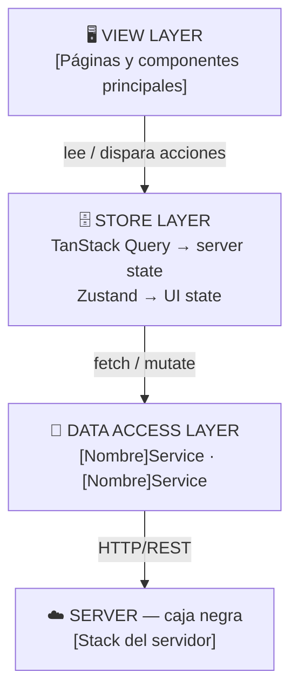
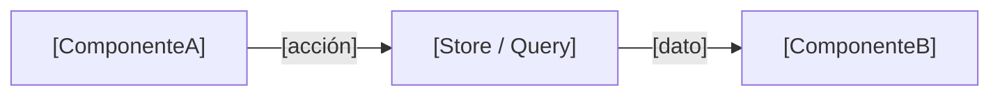

# Architecture — [Nombre del Proyecto]

> Una línea que describa qué estás construyendo.
> Ejemplo: "Dashboard de gestión de proyectos para equipos pequeños."

---

## R — Requirements

### ¿Qué estamos construyendo?

[Descripción en 2-3 oraciones. Qué hace la app, para quién y cuál
es el flujo principal.]

### Functional Requirements (scope de esta versión)

- [ ] Feature 1
- [ ] Feature 2
- [ ] Feature 3

### Out of scope

- Feature X → fase 2
- Feature Y → no aplica para este producto

### Non-functional Requirements

- **Plataformas:** Desktop / Mobile / Ambas
- **Usuarios estimados:** pequeño / medio / grande
- **Latencia aceptable:** < Xms para acciones críticas
- **Offline support:** sí / no / parcial
- **Autenticación:** requerida / opcional / sin auth
- **Accesibilidad:** WCAG 2.1 AA / básica / no definida
- **i18n:** un idioma / multi-idioma
- **SEO:** crítico / deseable / no aplica

---

## A — Architecture

### Diagrama de componentes cliente

> Reemplaza los corchetes con los nombres reales de tu proyecto.
> Cambia el protocolo si no es HTTP/REST (WebSocket, SSE, GraphQL).

### Componentes clave y sus responsabilidades

**[NombrePágina]** (View) — [responsabilidad en una línea].

**[NombreComponente]** (View) — [responsabilidad en una línea].

**use[Nombre]Query** (Store) — fetch y caché de [entidad] via TanStack Query.

**use[Nombre]Store** (Store) — [qué UI state maneja] via Zustand.

**[nombre]Service** (Data access) — abstrae las llamadas HTTP a `/api/[recurso]`.

### Decisión de rendering strategy

[Explica qué estrategia usas y por qué: CSR, SSR, SSG, ISR o una
combinación. Una o dos oraciones justificando la decisión en el
contexto de este proyecto.]

---

## D — Data Model

### Server-originated data

Datos que vienen del servidor y se cachean via TanStack Query.

**[Entidad]**

- `id` — [tipo], identificador único
- `[campo]` — [tipo], [descripción]
- `[campo]` — [tipo], [descripción]
- `createdAt` — ISO 8601

Cache strategy: `staleTime: [X]`. [Justificación en una línea.]

### Client-only data (efímero)

Datos que viven solo en el cliente y se pierden al recargar.

**[nombre]** — [tipo]. [Propósito]. Vive en [Zustand store / useState local].

> Regla práctica: si el usuario cierra la tab y lo pierde, es client-only.
> Si necesita estar disponible después de recargar, va al servidor.

---

## I — Interface Definition

### Endpoints consumidos

Ver `/docs/api-contracts.md` para el detalle completo.

Resumen:

- `[MÉTODO] /api/[recurso]`
- `[MÉTODO] /api/[recurso]/:id`

### Protocolo de comunicación

**[HTTP/REST / WebSocket / SSE / GraphQL]** — [justificación en una línea].

### Comunicación entre componentes cliente

[Descripción en prosa de los flujos más importantes.]

---

## O — Optimizations

### Performance

[Qué optimizaciones de performance aplicas y por qué.
Si no aplicas ninguna en v1, explica por qué no es necesario todavía.]

### Networking

[Estrategia de caché, optimistic updates, paginación, prefetching.
Qué decisiones tomaste y cuál es el razonamiento detrás de cada una.]

### User Experience

**Cargando** — [qué muestras mientras cargan los datos].

**Error de red** — [cómo lo comunicas al usuario].

**Estado vacío** — [qué muestras cuando no hay datos].

**[Otro estado relevante]** — [cómo lo manejas].

### Accesibilidad

[Qué decisiones de accesibilidad aplicas: semántica HTML, ARIA,
navegación por teclado, contraste. Sé específico sobre lo que
realmente implementas, no una lista genérica.]

### Seguridad

[Cómo manejas auth tokens, qué rutas proteges, qué riesgos
mitigas y cómo. Solo lo relevante para el frontend.]

### Pendiente de decisión

- [ ] [Decisión que todavía no tomaste]
- [ ] [Otra decisión pendiente]
